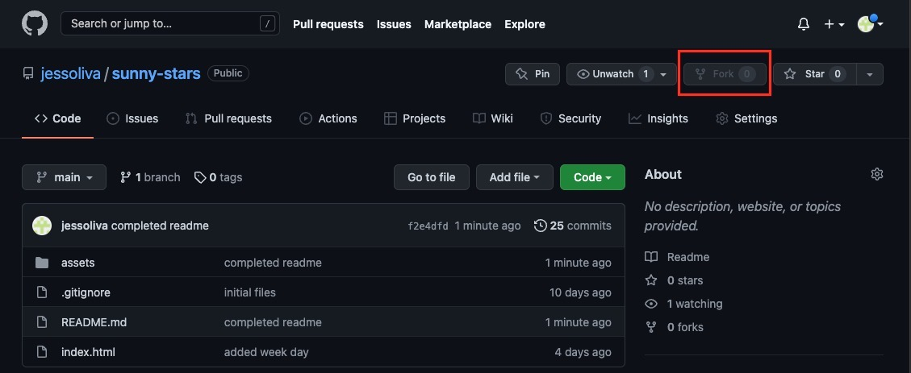

# Speedy's Adoption Central

This app is perfect to manage data of adoptable animals from different shelters located in different cities! 😊

## 📚&nbsp; Table of Contents

- [✨&nbsp; Description](#description)
- [🌼&nbsp; Features](#features)
- [🛠️&nbsp; Installation](#installation)
- [👩🏽‍💻&nbsp; Usage](#usage)
- [✏️&nbsp; Contribution Guidelines](#contribution-guidelines)
- [👨‍👩‍👧‍👦&nbsp; Credits](#credits)
- [📱&nbsp; Contact](#contact)
- [📰&nbsp; License](#license)

## ✨&nbsp; Description

A content management system for non-developers. This is a command-line application used to manage a database. Created its functionality with Node.js, inquirer, and MySQL. Cfonts and Gradient-String were used to provide a colorful user interface! 

## 🌼&nbsp; Features

App Features
- Specific for managing a database with information for adoptable animals
- User friendly and colorful interface
- Cfonts used to display app name beautifully in the command-line
- Functionality to view data in formatted tables
    - adoptable animals
    - shelters
    - cities
- Able to add shelter with same name but located in a different city
- Able to add city with same name but located in a different state
- Able to add an animal with same name and breed but located in a different shelter

Code Features
- CRUD operations
- Async Await functions
- Function that stores data in database in sentence case
- Several conditional statements to enable extensive manipulation of the database

Future Functionality
- Ability to edit additional information for the animals, shelters, cities in the database
- Ability to add city after 'Add Shelter' selection in case city location of the shelter is not in the database
- Ability to add shelter after 'Add Animal' selection in case shelter location of the animal is not in the database
- Refactor code and implement DRY in additional areas

## 🛠️&nbsp; Installation

At the main page of the manage-pet repository click on 'Fork' on the right hand side. This will clone the repository onto your GitHub!

&emsp;&emsp;&emsp; 

Then go to the main page of the forked repository on your GitHub and click on '<> Code'. From there, copy your preferred URL to clone the repository onto your computer. My go to is SSH!

&emsp;&emsp;&emsp; 

Go to your terminal or the VSCode terminal, cd into the directory you want the cloned repository to be located in and enter the following command and replace the placeholder with the URL link you copied:

    git clone <INSERT-COPIED-URL>

Ensure to install Node.js and npm.

Next, open the repository you cloned in Visual Studio Code. In the terminal enter the following command to install the dependencies required for the app:

    npm i

Now the manage-pet repository is on your GitHub and local computer, and ready to be used! 

## 👩🏽‍💻&nbsp; Usage

To use, run the following command:

    npm start

✨ Checkout the [walk-through video](https://drive.google.com/file/d/1-_azyN1IbNZO9dvEtq5hhYy7eYpxo50v/view?usp=sharing)  
Also located in: assets/walk-through.mov

## ✏️&nbsp; Contribution Guidelines

## 👨‍👩‍👧‍👦&nbsp; Credits

- [MDN Web Docs](https://developer.mozilla.org/en-US/)
- [W3Schools - event onchange](https://www.w3schools.com/)
- [Stack Overflow](https://stackoverflow.com/)

## 📱&nbsp; Contact

If you have any questions related to this project, or you just want to interact, you can reach me via GitHub or E-mail!

> Github: [jess-oliva](https://github.com/jess)

> E-mail: [jessoliva.g@gmail.com](mailto:jess)

## 📰&nbsp; License

    Copyright 2022 Jessica Olivares

Permission is hereby granted, free of charge, to any person obtaining a copy of this software and associated documentation files (the "Software"), to deal in the Software without restriction, including without limitation the rights to use, copy, modify, merge, publish, distribute, sublicense, and/or sell copies of the Software, and to permit persons to whom the Software is furnished to do so, subject to the following conditions:

The above copyright notice and this permission notice shall be included in all copies or substantial portions of the Software.

THE SOFTWARE IS PROVIDED "AS IS", WITHOUT WARRANTY OF ANY KIND, EXPRESS OR IMPLIED, INCLUDING BUT NOT LIMITED TO THE WARRANTIES OF MERCHANTABILITY, FITNESS FOR A PARTICULAR PURPOSE AND NONINFRINGEMENT. IN NO EVENT SHALL THE AUTHORS OR COPYRIGHT HOLDERS BE LIABLE FOR ANY CLAIM, DAMAGES OR OTHER LIABILITY, WHETHER IN AN ACTION OF CONTRACT, TORT OR OTHERWISE, ARISING FROM, OUT OF OR IN CONNECTION WITH THE SOFTWARE OR THE USE OR OTHER DEALINGS IN THE SOFTWARE.